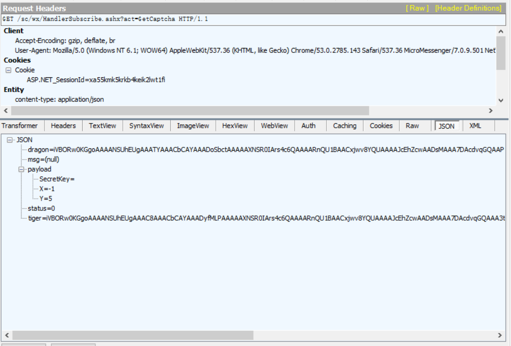

# 知苗易约抢购小程序

 **尚未完成，因技术原因卡在了滑块验证码上，希望有人能给出建议**

**建了个群，感兴趣的可以加一下：788512807**

* 问题进度
  * 【解决中。。】滑块验证码的x轴坐标可通过opencv来解决。附一个大佬的Python代码，亲测可用https://github.com/crazyxw/SlideCrack
  * **【已解决】滑块验证码获取需要一个zftsl的参数，猜测与时间戳和sessionid有关，目前无法得到该值，故无法拿到滑块验证码文本。**

* 问题分析（**已解决**）：

  验证码如下图：

​	经抓包获取验证码得到如下内容。并未找到图片验证码，而是一串JSON文本。此时根据文本无法分析得到滑块X轴坐标。

* 解决方案

  dragon为背景图片base64编码，可根据dragon值解码成图片

  tiger为滑块图片base64编码，可根据tiger值解码成图片
